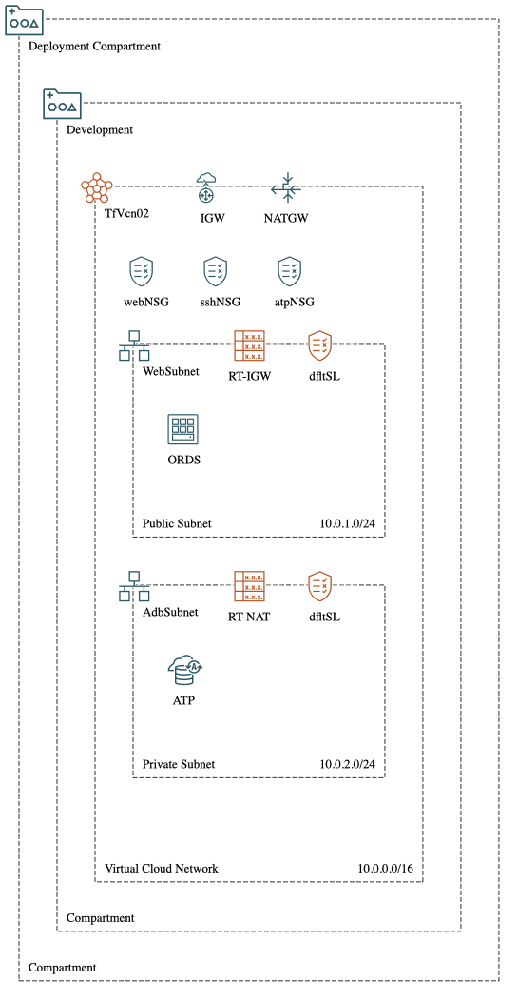

# oci-ords-atp-pvt-ep
Deploy Customer Managed Oracle REST Data Services and connected to Autonomous Database on private subnet using terraform CLI as IaaC

## Introduction

### Clone this Repository

```
git clone https://github.com/tossbrink/oci-ords-atp-pvt-ep-tf.git
```

## Architecture Diagaram



## Prerequisites
### Install Python
- [Python Download] (https://www.python.org/downloads/)

### Install and Config oci cli

```shell
 brew update && brew install oci-cli
```

- [Install and publish python packages] (https://pypi.org/project/oci-cli/)
- [Working with CLI] https://docs.oracle.com/en-us/iaas/Content/API/Concepts/cliconcepts.htm

### Install Terraform
- [Download] (https://www.terraform.io/downloads)
- [Tutorials] https://learn.hashicorp.com/tutorials/terraform/install-cli?in=terraform/oci-get-started

### OCI Tenancy

- Permission to `manage` the following types of resources in your Oracle Cloud Infrastructure tenancy on the compartment specficed in terraform.tfvars file: `vcns`, `internet-gateways`, `route-tables`, `network-security-groups`, `subnets`, `autonomous-database-family`, `tags` and `instances`.

## Do this first

### 1.Verify OCI cli configured correctly
```shell
 oci iam region list --output table
```

### 2.Edit terraform.tfvars file to point your tenancy, governance, IAM and other partameters
```
tenancy_ocid="<ocid.tenancy>"
compartment_ocid="<ocid.compartment>"
region="<region>"
fingerprint="<fignerprint>"
user_ocid="<ocid.user.>"
private_key_path="<~/.oci/oci_api_key.pem>"
ssh_public_key="<~/.ssh/id_rsa.pub>"
ATP_password = "<atppassword>"
```

## Deploy the Resources using Terraform CLI
### Create Resoruce
Run the following commands:

    terraform init
    terraform plan
    terraform apply

### Destroy the Deployment
When no longer needed you can destroy the resources:

    terraform destroy